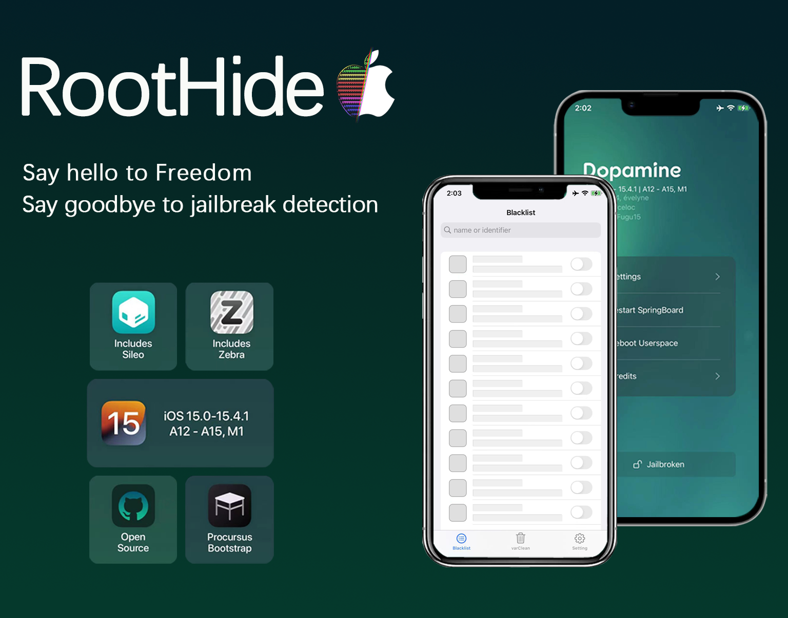

# Dopamine(RootHide)

RootHide is a completely hidden rootless jailbreak solution without to inject/modify/patch/hook apps.

This project is the RootHide implementation based on Dopamine Jailbreak.

- how to install: Download tipa file and install in trollstore, you don't have to uninstall rootless dopamine/xina15, you can switch them by rebooting the device.

- how to use: after jailbreak successful, the icon of the RootHide Manager App will appear on the home screen, open it to blacklist the apps that detect jailbreak, and use varClean to clean up junk files generated by other jailbreaks/tweaks. just so simple.

- about Tweaks: some tweaks have been ported to roothide. we will launch RootHidePatcher later so that some rootless tweaks can be converted into roothide tweaks.

- for Developers: dear developers, many tweaks just need to be recompiled to run with roothide, or minor modifications, see the developer document: https://github.com/RootHide/Developer

- for updates and support, follow [@RootHideDev](https://twitter.com/RootHideDev) on twitter or join our Discord server: https://discord.com/invite/scqCkumAYp

special thanks to: @opa334 @theosdev @ProcursusTeam @eveyineee @jakeashacks

# More Info

- Sileo Discrod Server: https://discord.gg/Udn4kQg

- Chariz Discord Server: https://discord.gg/sEzwNF9

- Havoc Discord Server: https://discord.gg/s2zc45h

- Zebra Discord Server: https://discord.gg/6CPtHBU

